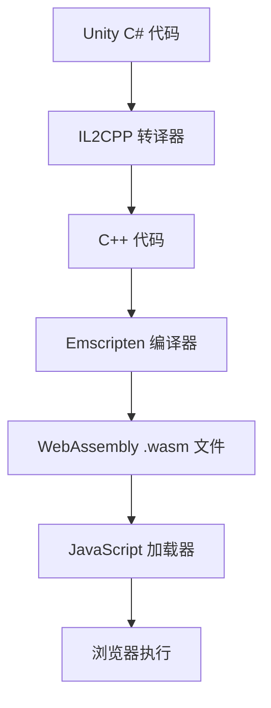
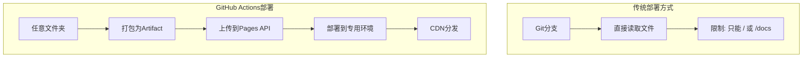

# Unity WebGL 部署到 GitHub Pages 完整指南：踩坑与解决方案

## 前言

最近将Unity WebGL游戏部署到GitHub Pages时遇到了不少坑，经过一番折腾终于成功部署。本文记录了完整的部署过程以及遇到的各种问题和解决方案，希望能帮助其他开发者避免这些坑。

## 项目背景

- **项目类型**：Unity 2D游戏
- **构建目标**：WebGL
- **部署平台**：GitHub Pages
- **仓库**：https://github.com/kkjusdoit/Chase-demo

## 部署过程概览

### 第一步：Unity WebGL构建
1. 在Unity中选择 `File → Build Settings`
2. 选择 `WebGL` 平台
3. 点击 `Build` 并选择输出文件夹（我选择了`build`文件夹）

构建完成后，`build`文件夹包含：
```
build/
├── index.html          # 主页面
├── Build/              # Unity构建文件
│   ├── build.data
│   ├── build.framework.js
│   ├── build.loader.js
│   └── build.wasm
└── TemplateData/       # 样式和资源文件
    ├── style.css
    ├── favicon.ico
    └── 各种图标文件...
```

### 第二步：Git初始化和GitHub仓库创建
```bash
# 初始化Git仓库
git init

# 创建.gitignore文件（重要！）
# 忽略Unity不需要的文件，但保留build文件夹
```

## 技术原理深度解析

### 🧠 Unity WebGL与WebAssembly原理

#### WebAssembly (WASM) 简介
WebAssembly是一种新的编码格式，为Web平台带来了接近原生性能的执行效果：

**核心特性：**
- **二进制格式**：紧凑的二进制指令格式，加载和解析速度快
- **接近原生性能**：在浏览器中运行速度比JavaScript快10-800倍
- **安全沙箱**：在浏览器的安全沙箱环境中运行
- **跨平台**：支持所有主流浏览器和操作系统

#### Unity WebGL构建过程


**构建产物解析：**
- **build.wasm**: 主要的WebAssembly二进制文件，包含游戏逻辑
- **build.data**: 游戏资源文件（纹理、音频、场景等）的打包数据
- **build.framework.js**: Unity运行时框架的JavaScript代码
- **build.loader.js**: 负责加载和初始化WASM模块的JavaScript代码

**性能对比分析：**
```javascript
// 传统JavaScript游戏引擎
function gameLoop() {
    // JavaScript JIT编译，但仍有性能瓶颈
    updatePhysics();      // ~10-50ms (复杂物理计算)
    renderGraphics();     // ~16ms (60FPS目标)
    // 总计：可能无法稳定达到60FPS
}

// Unity WebGL + WASM
// C#代码 → IL2CPP → C++ → WASM
// 物理计算: ~2-8ms (性能提升5-10倍)
// 渲染优化: 通过WebGL直接调用GPU
// 内存管理: 预分配内存池，减少GC压力
```

**WASM内存模型：**
- **线性内存**：WASM使用单一的线性内存空间
- **手动管理**：Unity通过IL2CPP实现精确的内存控制
- **零拷贝**：JavaScript和WASM之间可以零拷贝共享数据

**加载优化技术：**
```javascript
// Unity WebGL加载优化
const config = {
    dataUrl: "Build/build.data",           // 资源文件
    frameworkUrl: "Build/build.framework.js", // 运行时框架
    codeUrl: "Build/build.wasm",           // 主要逻辑代码
    
    // 流式加载优化
    streamingAssetsUrl: "StreamingAssets",
    
    // 压缩优化
    compressedFormat: "gzip", // 或 "brotli"
    
    // 内存优化
    memorySize: 268435456, // 256MB预分配
};
```

### ⚙️ GitHub Actions自动部署原理

#### GitHub Actions工作流程


#### 详细工作流解析
```yaml
# 触发条件：推送到main分支时自动运行
on:
  push:
    branches: [ main ]
  workflow_dispatch:  # 允许手动触发

# 权限设置：现代GitHub Pages需要的权限
permissions:
  contents: read      # 读取仓库内容
  pages: write        # 写入Pages
  id-token: write     # 用于身份验证

# 并发控制：避免多个部署同时进行
concurrency:
  group: "pages"
  cancel-in-progress: false

jobs:
  deploy:
    # 指定运行环境
    environment:
      name: github-pages
      url: ${{ steps.deployment.outputs.page_url }}
    runs-on: ubuntu-latest
    
    steps:
      # 1. 检出代码
      - name: Checkout
        uses: actions/checkout@v4
        
      # 2. 配置GitHub Pages
      - name: Setup Pages
        uses: actions/configure-pages@v4
        
      # 3. 打包构建文件
      - name: Upload artifact
        uses: actions/upload-pages-artifact@v3
        with:
          path: './build'  # 指定要部署的文件夹
          
      # 4. 部署到GitHub Pages
      - name: Deploy to GitHub Pages
        id: deployment
        uses: actions/deploy-pages@v4
```

#### GitHub Pages部署机制深度解析

**传统部署 vs Actions部署：**


**Actions部署技术细节：**
1. **Artifact系统**：
   ```bash
   # Actions内部执行过程
   tar -czf artifact.tar.gz ./build/*
   # 上传到GitHub的Artifact存储系统
   # Artifact具有90天的保留期限
   ```

2. **Pages API调用**：
   ```javascript
   // GitHub内部API调用（简化版）
   const deployment = await octokit.rest.repos.createPagesDeployment({
     owner: 'kkjusdoit',
     repo: 'Chase-demo',
     artifact_url: 'https://artifacts.github.com/...',
     pages_build_version: 'v1.2.0',
     oidc_token: process.env.GITHUB_TOKEN
   });
   ```

3. **CDN分发架构**：
   - **边缘节点**：全球200+个CDN节点
   - **缓存策略**：静态资源缓存TTL为1小时
   - **压缩**：自动启用Gzip/Brotli压缩
   - **HTTP/2**：支持多路复用，提升加载速度

4. **安全机制**：
   ```yaml
   # OIDC (OpenID Connect) 身份验证
   permissions:
     id-token: write  # 生成临时身份令牌
     pages: write     # 获得Pages写权限
   # 无需长期存储敏感Token
   ```

**性能优化原理：**
- **预编译**：WASM文件在部署时已完成编译
- **并行加载**：.wasm、.data、.js文件可并行下载
- **增量更新**：只有变更的文件会重新下载
- **Service Worker**：可实现离线缓存（需额外配置）

## 遇到的主要问题和解决方案

### 🚫 坑1：GitHub Pages文件夹限制

**问题**：GitHub Pages只支持从根目录(`/`)或`/docs`文件夹部署，不支持自定义文件夹如`/build`。

**技术原理**：GitHub Pages的传统部署方式是直接从Git分支的特定文件夹读取静态文件，这种方式限制了文件夹选择。

**解决方案**：GitHub Actions + Pages API
- 使用Actions将任意文件夹内容打包为artifact
- 通过Pages API部署到专用的pages环境
- 绕过传统的文件夹限制

### 🚫 坑2：文件路径错误

**问题**：控制台错误 `GET https://kkjusdoit.github.io/Chase-demo/Build/build.loader.js net::ERR_ABORTED 404 (Not Found)`

**原因分析**：
- `index.html`中引用的路径是`"Build"`
- 但实际文件位置与引用路径不匹配

**错误的文件结构**：
```
根目录/
├── index.html
├── Build/              # 空文件夹或文件位置错误
├── build.data         # 文件位置错误
├── build.framework.js # 文件位置错误
└── ...
```

**正确的文件结构**：
```
build/                 # 这是GitHub Actions要部署的文件夹
├── index.html
├── Build/             # Unity构建文件必须在这里
│   ├── build.data
│   ├── build.framework.js
│   ├── build.loader.js
│   └── build.wasm
└── TemplateData/      # 样式文件必须在这里
    └── ...
```

### 🚫 坑3：Git认证问题

**问题**：推送时出现权限错误
```
ERROR: Permission to kkjusdoit/Chase-demo.git denied to linkunkun-SecretLisa.
fatal: Could not read from remote repository.
```

**原因**：
- 本地Git配置的用户信息与GitHub账户不匹配
- SSH密钥与当前账户不对应
- 使用了错误的远程仓库URL格式

**解决方案**：
```bash
# 1. 更新Git用户配置
git config user.name "kkjusdoit"
git config user.email "kkjusdoit@users.noreply.github.com"

# 2. 使用HTTPS格式的远程仓库URL
git remote set-url origin https://github.com/kkjusdoit/Chase-demo.git

# 3. 使用GitHub Desktop（推荐）
# 或者配置Personal Access Token
```

### 🚫 坑4：GitHub Pages设置错误

**问题**：设置了GitHub Pages但游戏无法加载

**错误设置**：
- Source: "Deploy from a branch"
- Branch: "main"
- Folder: "/ (root)"

**正确设置**：
- Source: "GitHub Actions" ✅


## 最终正确的部署流程

### 1. 准备工作
```bash
# 初始化Git仓库
git init

# 创建.gitignore（包含Unity常见忽略文件，但保留build文件夹）
echo "!/build/" >> .gitignore
```

### 2. 创建GitHub Actions工作流
创建`.github/workflows/deploy.yml`文件（内容见上面的YAML配置）

### 3. 提交并推送代码
```bash
git add .
git commit -m "初始提交：Unity WebGL项目"
git remote add origin https://github.com/username/repo-name.git
git push -u origin main
```

### 4. 配置GitHub Pages
1. 访问仓库的Settings → Pages
2. Source选择"GitHub Actions"
3. 保存设置

### 5. 等待自动部署
- GitHub Actions会自动运行
- 创建`gh-pages`分支
- 部署完成后访问：`https://username.github.io/repo-name/`

## 关键要点总结

### ✅ 正确做法
1. **保持原始文件结构**：不要移动build文件夹中的文件
2. **使用GitHub Actions**：这是处理自定义文件夹的最佳方案
3. **正确的Git配置**：确保用户名和邮箱与GitHub账户匹配
4. **使用HTTPS URL**：避免SSH密钥问题
5. **GitHub Desktop**：简化Git操作，避免命令行认证问题

### ❌ 避免的错误
1. 不要手动复制文件到根目录
2. 不要尝试从非标准文件夹部署
3. 不要忽略文件路径的大小写敏感性
4. 不要在调试时随意删除文件

## 性能优化深度指南

### 1. Unity构建优化技术细节

**IL2CPP编译优化：**
```csharp
// Player Settings → Configuration
// Master构建 vs Development构建性能差异可达30%
// Master: 完全优化，移除调试信息，代码内联
// Development: 保留调试符号，性能较低但便于调试
```

**代码剥离 (Code Stripping) 原理：**
```csharp
// 启用Managed Stripping Level = High
// Unity会分析代码依赖关系，移除未使用的代码
// 典型优化效果：
// - 未优化WASM: ~50MB
// - 高度剥离后: ~15MB (减少70%体积)

// 自定义剥离配置
// link.xml文件可保护特定代码不被剥离
<linker>
    <assembly fullname="Assembly-CSharp" preserve="all"/>
    <type fullname="MyImportantClass" preserve="all"/>
</linker>
```

**压缩算法对比：**
```bash
# 不同压缩算法效果对比 (以20MB原始WASM为例)
原始文件:     20.0 MB
Gzip:        6.2 MB  (69%压缩率, 解压速度: 快)
Brotli:      5.1 MB  (74%压缩率, 解压速度: 中等)  
LZ4:         8.5 MB  (57%压缩率, 解压速度: 极快)

# Unity推荐: Brotli (最佳压缩率)
# 浏览器支持: Chrome/Firefox/Safari 全支持
```

### 2. WebGL渲染优化

**GPU内存管理：**
```csharp
// 纹理压缩格式选择
// WebGL支持的格式及性能影响：
RGBA32: 4 bytes/pixel  - 最高质量，最大内存占用
RGB24:  3 bytes/pixel  - 无透明通道
DXT1:   0.5 bytes/pixel - 最佳压缩比，轻微质量损失
ASTC:   可变压缩比    - 现代移动设备最优选择

// 运行时纹理优化
Texture2D.Compress(false); // 运行时压缩
Resources.UnloadUnusedAssets(); // 清理未使用资源
```

**批处理优化：**
```csharp
// GPU Draw Call优化
// 静态批处理: 编译时合并网格
StaticBatchingUtility.Combine(gameObjects, root);

// 动态批处理: 运行时合并小网格
// 限制: 顶点数 < 300, 相同材质
// WebGL性能提升: 50-200%

// GPU Instancing: 相同网格大量绘制
Graphics.DrawMeshInstanced(mesh, 0, material, matrices);
```

### 3. 内存优化策略

**WASM内存模型深度解析：**
```javascript
// WASM线性内存布局
// 0x00000000 - 0x00100000: Unity运行时 (1MB)
// 0x00100000 - 0x10000000: 游戏堆内存 (255MB)
// 0x10000000 - 0x20000000: 资源缓存 (256MB)

// 内存增长策略
Module.wasmMemory = new WebAssembly.Memory({
    initial: 256,    // 初始256页 (16MB)
    maximum: 2048,   // 最大2048页 (128MB)
    shared: false    // WebGL不支持共享内存
});
```

**垃圾回收优化：**
```csharp
// Unity WebGL GC优化技巧
// 1. 对象池模式避免频繁分配
public class ObjectPool<T> where T : new() {
    private Stack<T> pool = new Stack<T>();
    
    public T Get() => pool.Count > 0 ? pool.Pop() : new T();
    public void Return(T item) => pool.Push(item);
}

// 2. 使用结构体减少堆分配
public struct Vector3Data { // 值类型，栈分配
    public float x, y, z;
}

// 3. 避免字符串拼接
StringBuilder sb = new StringBuilder(256); // 预分配容量
```

### 4. 网络加载优化

**资源分包策略：**
```csharp
// Addressables资源管理
// 核心资源: 首次加载 (~5MB)
// 关卡资源: 按需加载 (~2MB per level)
// 音频资源: 流式加载 (~500KB per track)

var handle = Addressables.LoadAssetAsync<GameObject>("level_01");
await handle.Task;
```

**CDN缓存优化：**
```javascript
// 资源版本控制
const resourceVersion = "v1.2.3";
const baseUrl = `https://cdn.example.com/game/${resourceVersion}/`;

// 利用浏览器缓存
// .wasm文件: Cache-Control: max-age=31536000 (1年)
// .data文件: Cache-Control: max-age=86400 (1天)
// index.html: Cache-Control: no-cache (总是验证)
```

## 调试技巧

### 1. 浏览器开发者工具
- 检查Network标签页查看文件加载情况
- 查看Console错误信息
- 验证文件路径是否正确

### 2. GitHub Actions调试
- 查看Actions标签页的运行日志
- 检查artifact上传是否成功
- 验证部署步骤是否完成

### 3. 本地测试
```bash
# 使用Python简单HTTP服务器测试
cd build
python -m http.server 8000
# 访问 http://localhost:8000
```

## 结语

Unity WebGL部署到GitHub Pages看似简单，但实际操作中会遇到各种坑。关键是理解GitHub Pages的限制，正确使用GitHub Actions，以及保持正确的文件结构。希望这篇文章能帮助其他开发者顺利完成部署！

## 参考资源

- [GitHub Pages文档](https://docs.github.com/en/pages)
- [GitHub Actions文档](https://docs.github.com/en/actions)
- [Unity WebGL构建指南](https://docs.unity3d.com/Manual/webgl-building.html)

---

**项目地址**：https://github.com/kkjusdoit/Chase-demo  
**在线演示**：https://kkjusdoit.github.io/Chase-demo/

*如果这篇文章对你有帮助，欢迎点个Star！⭐*
